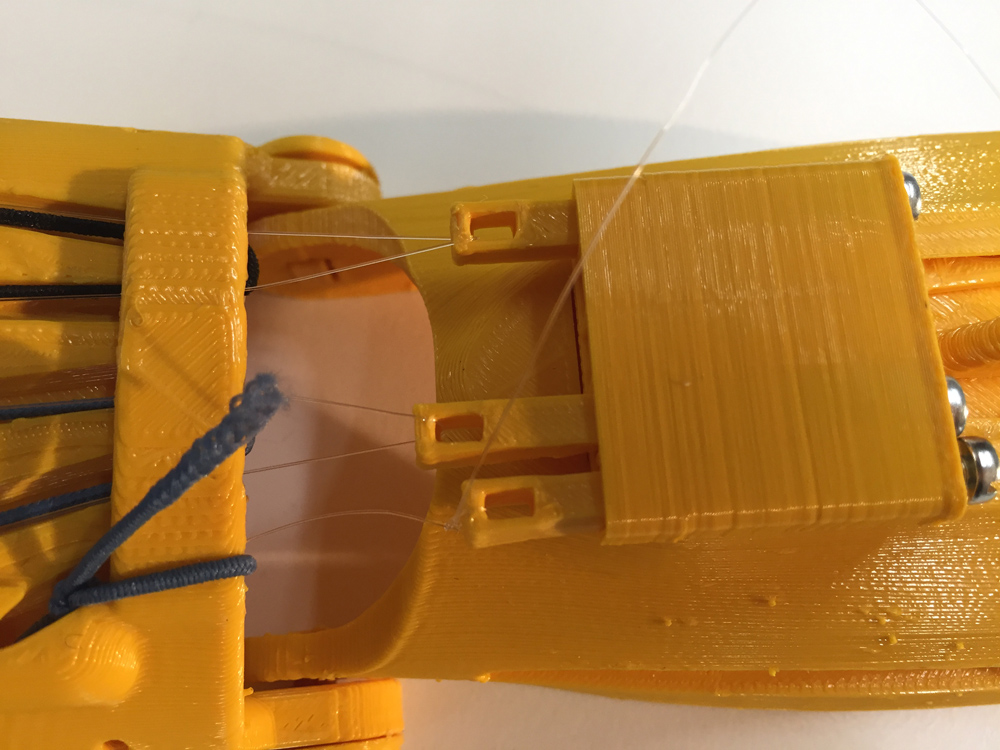

# makers prosthetic hand

Every year in France, 80 to 100 babies are born with a malformation. We call it agenesis.
Prostheses are very costly: between 41.000€ and 82.000€ for an artificial hand ! And because children are growing fast, they would need to change it every 2 years. Therefore, a very few number a kids with agenesis have one.
The ultimate paradox is that prostheses are not appropriate for hostile environments such as water or sand. Environments that kids love!

The association e-nable, a network of passionate volunteers, introduces kids to makers. The goal being to teach kids how to make their own opensource “raptor” prosthetic hand for less than 50€.

This bootcamp gave us the opportunity to make a test kit of the “raptor” prosthesis for a clinic while telling the story of an opensource object.

## Video

## Material

- Download the plastic hand pieces to 3D print on [e-nable website](https://e-nable.fr/)
- Rubber strips
- Nylon threads
- Screws

You will also need:
- 1 flat-head screwdriver
- 1 flat tweezers
- 1 cutter

## Step 1 - 3D print the hand

3D print the hand using [these files](files/hand-raptor-reloaded-minimal.zip).

  

## Step 2 - Phalanges & fingers assembly

- You will have to assemble 5 phalanges 1, 5 phalanges 2 and 5 rivets.  
- Sand each part to smooth the contact points/joints (fix 3D printing irregularities).  
- To make a finger, take one part of each type :
  - **Phalange 1** = fingernail phalanx (distal phalanx)
  - **Phalange 2** = phalanx connected to the hand (proximal phalanx)  
- The smooth part with the slot of phalanx 2 must be orented towards the bottom. La petite partie qui dépasse "la corne", sera au-dessus de l'articulation de la paume, il faut **emboîter** l'autre côté avec la phalange 1 (le coté sans "corne").
- Ajuster le **rivet**, en enfonçant d'abord le côté rond dans le trou rectangulaire. Ainsi, une fois poussé jusqu'au bout, les deux formes rectangulaires s'emboîtent et empêchent le rivet de glisser. On peut prendre appui sur la table.

## Step 3 - Wrist & palm assembly

- Arracher le support du poignet et enlever les aspérités des articulations.
- Poser le dos de la main et du poignet sur la table, paume orientée vers soi.
- **Ajuster** le poignet dans la paume, de façon à **aligner** les trous.
- Ajuster le **rivet**, en enfonçant d'abord le côté rond dans le trou rectangulaire. Intérieur vers extérieur. Ainsi, une fois poussé jusqu'au bout, les deux formes rectangulaires s'emboîtent et empêchent le rivet de glisser.
- Prendre la pince, pincer l'extrémité extérieur du rivet, de façon à en réduire le diamètre. Et ainsi insérer l'écrou en plastique. Retirer la pince pour que la face lisse de l'**écrou** soit en contact avec la main.

## Step 4 - Mikado box

- Coulisser le boîtier de l'arrière vers l'avant du poignet, sur ses rails, jusqu'à la buté, les trous rond vers l'arrière.
- Derrière, faire glisser dans les rails le "trident", pour bloquer la boîte à mikado.
- Prenez les 5 mikados et glissez les dans les trous du boîtier. Les trous des bâtons sont vers l'extérieur **comme sur la photo**.
- A l'aide d'un tourne vis à tête plate, visser chaque mikado en place en introduisant une vis du côté rond de la boîte à mikado.
- Vos 5 mikados sont maintenant en place.
- Pour les étapes qui suivent, nous allons relier uniquement 3 mikados sur 5 à des fils de nylon pour avoir un mouvement de doigts plus synchronisé.

## Step 5 - Hand fingers assembly

- Commencer par l'auriculaire - le rikiki.
- Insérer la base de l'auriculaire dans l'extrémité de la paume, aligner les trous.
- Ajuster le rivet (le grand rivet), en enfonçant d'abord le côté rond dans le trou rectangulaire. S’arrêter à mi-chemin, juste avant l'annulaire. L'emboiter et pousser le rivet jusqu'au bout, les deux formes rectangulaires s'emboîtent et empêchent le rivet de glisser.
- Répéter l'opération pour l'index puis le majeur.
- Les deux grands rivets peuvent avoir un défaut d'impression : il vous faudra peut-être retailler la fente avec le cutter.
- Finir par le pouce, avec le rivet plus petit.

## Step 6 - Rubber strips pulling

- Commencer par l'**auriculaire** - le rikiki. Introduire l'élastique dans le trou à la base de l'auriculaire. Le fil passe dans la phalange 2 et ressort à l'extrémité, à l'articulation. Il passe au-dessus de la phalange 1, puis en dessous.
- Faire un nœud plat pour accrocher l'élastique : une demi-clef vers la droite puis une deuxième vers la gauche.
- Tendre le fil afin qu'il y ait une bonne résistance au niveau des articulations.
- Prendre l'autre bout de l'élastique (le dormant). Le faire glisser dans le rail. Le rail est le trou en bas de la paume qui relie deux doigts. Faire passer le fil sur le dos de la main et répéter l'opération précédente pour l'annuaire : un nœud plat au bout de chaque doigt.
- Faire une pause qualité avant e continuer avec les autres doigts.
- Pause contrôle qualité : replier manuellement les doigts dans la paume, puis relâcher. Les doigts doivent remonter automatiquement, sinon resserrer l'élastique. Si ça ne marche pas, vous devrez limer l'articulation pour laisser un peu d'espace et permettre aux deux parties de coulisser.
- Toutefois veiller à garder une certaine souplesse
- Répéter les mêmes étapes pour l'**index** et le **majeur**, avec un **deuxième élastique**.
- Avec un troisième élastique, répéter l'opération pour le **pouce**.

## Step 7 - Nylon threads knotting

- Faire un nœud plat au bout de la phalange 1 intérieur, passer à l'intérieur de la phalange 2, toujours dans l'intérieur puis traverser la paume et suivre l'élastique.
- Entrer dans le tunnel, toujours en suivant l'élastique, et réaliser un nœud plat sur le trou du mikado associé.
- Répéter l'opération pour les cinq doigts de la main.
*Pour les finitions, couper au ciseau les fils qui dépasse des nœuds.*

## Step 8 - Velcro strap positioning

Six scratchs sont à positionner.
- **Formation des scratchs du bas**, au niveau du poignet :  
découper deux scratchs : un de 13cm et l'autre de 11cm.
- Passer les au niveau des fentes du poignet. Le plus long viendra couvrir le plus court.  

- **Formation des scratchs du haut**, au niveau de la paume :  
découper deux scratchs : un de 5cm et l'autre de 9cm.
- Ne pas placer les scratchs.
- Percer les scratchs du haut afin de faciliter le placement ds vis. Placer les vis dans le scratch et visser.
- Découper des petits morceaux de scratch afin de faire des caches pour les vis du haut.
- Placer les scratchs du bas.

## Step 9 - Finishing touches

- Faire des points de colle sur les nœuds en nylon afin qu'ils tiennent plus longtemps.
- Découper les fils de nylon et d'élastique qui dépassent.

Bravo, vous avez réussi votre montage haut la main !

## Notes et références

- Site officiel de l'association e-nable : https://e-nable.fr/
- Site du makers' lab d'emlyon business school : http://makerslab.em-lyon.com/
